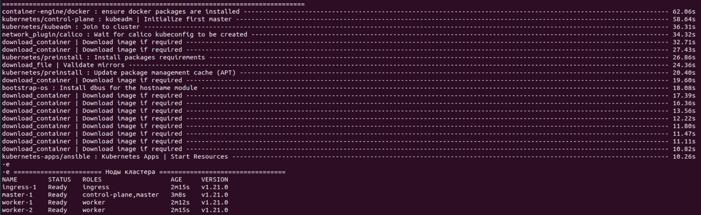

# SF DevOps Diploma - Sprint 1 - Infra

## Задача

Опишите инфраструктуру будущего проекта в виде кода с инструкциями по развертке, нужен кластер Kubernetes и служебный сервер (будем называть его srv)

- Выбираем облачный провайдер и инфраструктуру 
- Описываем инфраструктуру
- Автоматизируем установку

**Необходимо:**
- сервер **srv** для логгинга, мониторинга и сборки контейнеров.
- Kubernetes cluster;

Инфраструктура описывается в Terraform.

---

## Развертывание сервера srv
1. Действия производим на локальном хосте с Unix(проверено на Ubuntu 22.04)
2. Должен быть установлен terraform. В директории `~/.ssh/` сгенерированы ssh-ключи `id_rsa`и `id_rsa.pub` без пароля
2. Клонируем репу `git clone https://github.com/IlyaPleshachev/devops_diploma_sprint1.git`
3. В директории `/terraform` выполняем инициализацию `terraform init`
4. Применяем настройки облака yandex-cloud `terraform apply -var="yandex_cloud_token=<токен>" -var="cloud_id=<cloud_id>" -var="folder_id=<folder_id>"`
5. Пример полученного ip-адреса сервера **srv**(у вас будут другой):
```
external_ip_address_srv = [["148.145.65.104"]]
```

## Развертывание k8s
1. Подключиться к серверу srv `ssh ubuntu@<external_ip_address_srv>`
2. Получить права СЮ `sudo su`
3. В директории `cd /opt/kubernetes_setup` выполнить `sh cluster_install.sh`

После развёртывания получаем информацию об инфраструктуре. Пример:
```
instance_group_ingresses_public_ips = tolist(["148.145.103.244"])

load_balancer_public_ip = tolist(["148.145.106.132"])
```

5. Разворачивание кластера k8s начнется автоматические при помощи **Ansible**. 
---
## Результат

---

## Этап удаления(при необходимости)
1. На **srv**: `sudo su`, `cd /opt/kubernetes_setup`, `sh cluster_destroy.sh`
2. На локальном хосте в каталоге `SF_DevOps/terraform`: `terraform destroy -var="yandex_cloud_token=<токен>" -var="cloud_id=<cloud_id>" -var="folder_id=<folder_id>"`
